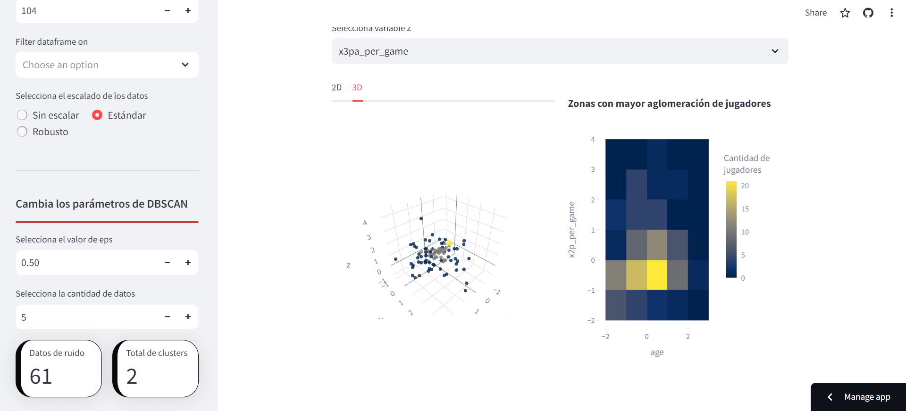
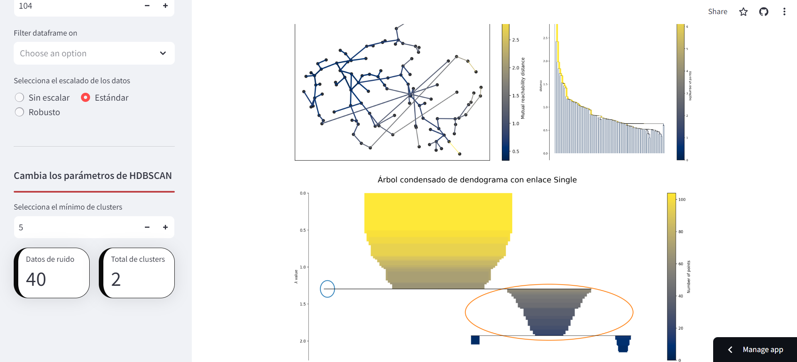
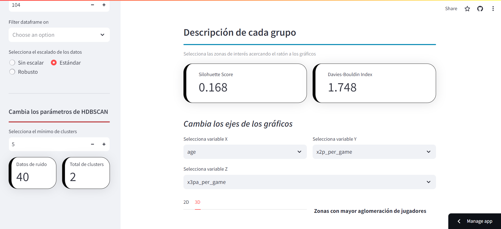

# Clustering de Jugadores NBA por Densidad

Dashboard interactivo para comparar DBSCAN y HDBSCAN sobre estadísticas de jugadores de la NBA (2013-2023), ajustando parámetros de clustering en vivo.

**[Ver dashboard en Streamlit →](https://clustering-comparison.streamlit.app/)**
*(si aparece dormido, esperá unos segundos a que despierte — es normal en el free tier de Streamlit Cloud tras un tiempo sin visitas)*



## Qué hace

Aplica clustering basado en densidad (no basado en centroides, como k-means) a las estadísticas por partido de jugadores NBA, para agrupar jugadores con perfiles estadísticos similares sin asumir de antemano cuántos grupos existen. El usuario elige las variables, la cantidad de datos, el escalado (sin escalar / estándar / robusto) y compara DBSCAN vs. HDBSCAN ajustando sus parámetros en tiempo real.

| DBSCAN | HDBSCAN |
|---|---|
|  |  |

## Estructura

```
streamlit_app.py     → entry point de la app (Streamlit Cloud corre este archivo desde la raíz)
codigos/
  clean_data.py       → filtra y limpia las estadísticas crudas (genera datos/bases/PPG_data.csv)
  pages.py             → páginas del dashboard (Home, DBSCAN, HDBSCAN)
  style.css
datos/bases/
  Player Per Game.csv  → estadísticas crudas por jugador/temporada
  PPG_data.csv          → versión filtrada (2013-2023, sin columnas de porcentaje) que consume la app
datos/resultados/      → capturas del dashboard
```

`streamlit_app.py` lee `PPG_data.csv` directo desde GitHub (`raw.githubusercontent.com/.../datos/bases/PPG_data.csv`), no desde el filesystem local — por eso esta ruta importa: cualquier cambio a `datos/bases/PPG_data.csv` recién se refleja en el dashboard después de un `git push` a `main`.

## Stack

Python — `streamlit`, `streamlit-option-menu`, `streamlit-extras`, `scikit-learn` (`StandardScaler`, `RobustScaler`), `pandas`.

*IECD421: Visualización de Datos — Bastián Barraza, 2023.*
